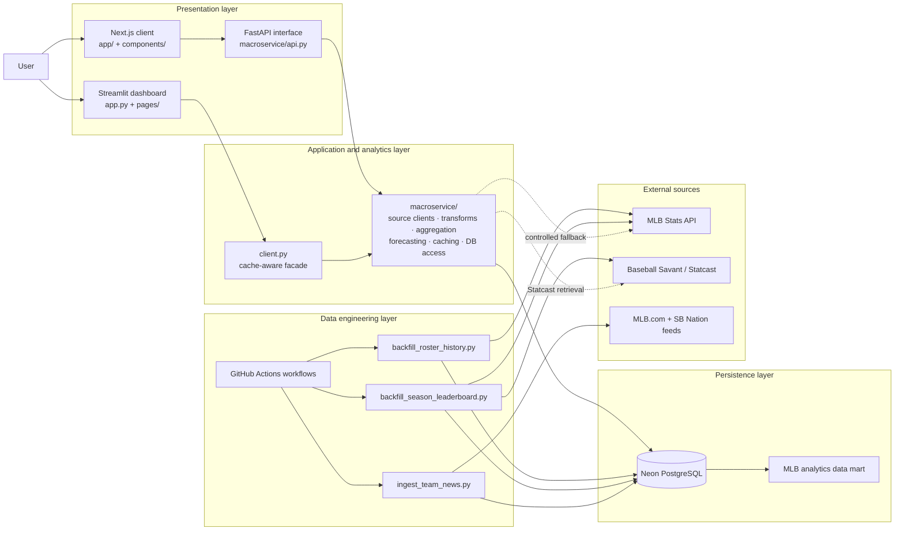

> A full-stack MLB analytics platform that ingests public sports data into a PostgreSQL cache, powers interactive player and leaderboard analysis, and evaluates time-series forecasting models with rolling features and leakage-aware validation.

[](#)
[](#)
[](#)
[](#)
[](#)
---
## Project Overview

Public sports-data APIs are useful for exploration but are a poor direct backend for an interactive analytics product: they can be slow and incomplete for historical records and/or rate-limited during dashboard requests. This project separates data acquisition from user-facing analysis while using a macro-service architecture design.

My data-engineering layer uses cache-aware ingestion and scheduled workflow pipelines to load public messy, semi-structured MLB, Statcast, and RSS data into a Neon PostgreSQL analytics data mart. It applies idempotent upserts, retry/backoff controls, and dataset-specific freshness policies so that historical data can be retrieved reliably without repeatedly calling upstream sources.

My analytics layer uses this curated datastore to compute and explain KPIs, rate- and count-stat aggregations, season leaderboards, historical time series, rolling sabermetrics, team/player cohorts, and interactive visualizations. Counting statistics are aggregated by summation, while rate statistics are aggregated by mean so multi-player comparisons remain statistically interpretable. You can check it out on the streamlit link. Note that the streamlit is a prototype dashboard with all frontend being ported to Vercel, so elements of the macro-service communicating with the datastore may break.

The machine-learning layer treats player performance as an ordered time-series regression problem. It transforms player game logs and Statcast observations into rolling targets and feature matrices containing wOBA-style offensive aggregates, FIP-oriented pitching measures, momentum, rest days, home/away context, velocity, whiff rate, and batted-ball-quality variables. Candidate regressors—including Ridge, SVR, Huber, Gaussian Process Regression, Random Forest, HistGradientBoosting, and ensemble baselines—are evaluated with chronological train/validation splits and walk-forward cross-validation. Performance is reported with \(R^2\), RMSE, and MAE to compare predictive fit and absolute forecast error without temporal leakage.

---
## Contents:

[Project Guide](##-Project-Repository-Guide)

[Setup and Inspection](##-Setup-&-Inspection)

[Project Architecture](##-Project-Architecture-&-Data-Engineering)

[Math Computations](##-Analytical-and-ML-Computations)

[Limitations](##-Limitations)

[References](##-References-&-Acknowledgements)

---
## Project Repository Guide


#### Worktree:
```text
app.py                         Streamlit entry point and shared navigation
pages/                         Streamlit Analytics & Forecasts and Insights pages
client.py                      UI-facing cache-aware data-access facade
chart.py                       Plotly chart construction

macroservice/
  api.py                       FastAPI adapter
  db.py                        Database configuration and schema initialization
  *_db.py                      Persistence and query modules
  teams.py                     Team, roster, and schedule client
  players.py                   Player game-log and season-stat client
  statcast*.py                 Statcast retrieval and season aggregation
  features.py                  Derived feature and sabermetric construction
  regression.py                Regression implementations
  trajectories.py              Forecast and trajectory orchestration
  news.py                      Team-news source retrieval and parsing
  backoff.py                   Upstream retry behavior
  caching.py                   TTL caching primitives

db/schema.sql                  PostgreSQL schema
scripts/                       Backfill, ingestion, and forecast-loading CLI jobs
.github/workflows/             Scheduled/manual GitHub Actions jobs
notebooks/                     EDA, model evaluation, Kaggle GPU runs, smoke results
tests/                         Unit and database-integration tests
utils/                         Shared aggregation, filters, formatting, and UI helpers

app/, components/, lib/        Next.js/TypeScript interface
```

Generated local folders such as `.venv/`, `.next/`, and `node_modules/` are intentionally excluded through `.gitignore`.

---
## Setup & Instructions

### Local Installation

If you wish to clone this project locally and analyze the worktree:

```bash
# Clone the repository and navigate inside
git clone https://github.com/A-Kuo/MLB-Analytics-and-Forecasting-App
cd MLB-Analytics-and-Forecasting-App

# Create and activate your virtual environment
python -m venv .venv 
source .venv/bin/activate  # On Windows use: .venv\Scripts\activate

# Install the primary runtime dependencies
pip install -r requirements.txt
```

#### Environment Variables (Optional)
Copy the configuration template to register external API integrations:
```bash
cp .env.example .env
```
> Add `NEWS_API_KEY` to .env. Without it, the application fallback pipeline automatically switches to MLB.com's public RSS feed.*

---

### Running the Application

The web dashboard is built using Streamlit. To run the analytics application locally:

```bash
streamlit run app.py
```

#### Optional: Standalone API Service
The `macroservice/` package can also execute independently as a REST API (this is completely optional, as the primary Streamlit dashboard calls this module in-process):

```bash
uvicorn macroservice.api:app --reload
```

---

### Automated Testing Framework

The repository maintains an intensive unit and integration suite covering data layers, state transformations, modeling logic, and system infrastructure. 

To configure the development dependencies and evaluate the test coverage:

```bash
# Install testing tools and run the suite
pip install -r requirements-dev.txt
pytest -q
```

Our current test pipeline covers validation across these foundational layers:
* **Analytical Transformations:** Rolling feature engineering, sabermetric metric selections, and player-cohort aggregations.
* **Network & Database Infrastructure:** API retry/backoff policies, TTL caching boundaries, PostgreSQL schema configurations, and idempotent upsert routes.
* **Content Aggregation Pipelines:** News-feed parsing, data deduplication, and card-rendering mechanics.
* **Machine Learning Engine:** Trajectory forecasting vectors, regression behaviors, and UI-state synchronization.

---

### Notebook & Experimental Artifacts

The notebook workflow documents position-aware data preparation, rolling feature construction, sabermetric transformations, model comparisons, walk-forward validation, hyperparameter tuning, and error evaluation.

* [MLB Aggregate-Model Evaluation Notebook](notebooks/mlb-aggregate-models-v2.ipynb)
* [Kaggle GPU Season-Aggregate Workflow](notebooks/kaggle/season_aggregate_gpu/season_aggregate_gpu.ipynb)
* [Kaggle GPU Statcast-Era Workflow](notebooks/kaggle/statcast_era_gpu/statcast_era_gpu.ipynb)
* [Smoke-Test Output: Season Aggregate](notebooks/results/season_aggregate-2026.08.27-0045-smoke.json)
* [Smoke-Test Output: Statcast Era](notebooks/results/statcast_era-2026.08.27-0154-smoke.json)


---
## Project Architecture & Data Engineering

### Architecture



### Neon PostgreSQL datastore

Neon PostgreSQL acts as a domain-specific MLB analytics datastore rather than an enterprise-scale data lake. It stores curated, relational data needed by the application, including player biographies, roster history, team-season associations, player season statistics, Statcast aggregates, leaderboard inputs, and team-news records.

The database is designed for application-serving and analytical queries rather than raw file retention. Backfill jobs and lazy cache warming persist data through idempotent upserts, making partial jobs safe to retry.

### Data lifecycle

| Dataset | Source | Refresh path | Storage behavior | Application behavior |
|---|---|---|---|---|
| Team and player metadata | MLB Stats API | Monthly/manual roster-history backfill | Stored in player and roster-history tables | PostgreSQL-first with supported live fallback |
| Completed-season statistics | MLB Stats API | On-demand season backfill and lazy cache warming | Stored by player, team, season, and stat group | PostgreSQL-first |
| Current-season statistics | MLB Stats API | Dashboard request or manual refresh | Treated as mutable | Short-TTL retrieval to preserve freshness |
| Statcast aggregates | Baseball Savant | Per-season backfill and cache warming | Stored by player and season | Unified with standard metrics where available |
| Insights leaderboards | Derived from stored season data | Per-season leaderboard backfill | Stored/queryable through season-scoped relations | PostgreSQL-only to avoid high-volume live API calls |
| Team news | MLB.com and SB Nation feeds | GitHub Actions every 6 hours | Deduplicated, upserted, and pruned | PostgreSQL-only; never scraped during dashboard interaction |

### Operational workflows

| Workflow | Trigger | Responsibility |
|---|---|---|
| `ingest_team_news.yml` | Every 6 hours and manual dispatch | Ingests, deduplicates, upserts, and prunes team-news records |
| `backfill_roster_history.yml` | Monthly and manual dispatch | Refreshes player biographies and historical roster data |
| `backfill_leaderboards.yml` | Manual dispatch | Populates season-scoped roster, player-stat, and Statcast data needed by Insights |

### Reliability and freshness controls

- Postgres-first reads reduce repetitive external API calls for historical data.
- Live API fallback preserves dashboard operation when a cache miss occurs on supported paths.
- Successful fallback responses can be written back to PostgreSQL to warm the cache.
- Retry/backoff logic handles transient upstream network failures.
- Database failure cooldown logic prevents a single outage from creating repeated connection attempts across wide aggregate computations.
- Completed historical seasons are treated differently from the mutable current season so cache behavior matches data freshness requirements.
---
## Analytical and ML Computations

If you want to know more about the mathematics I used in the data selection, and especially in the machine learning side, see below.

### Metric-aware cohort aggregation

For a selected player cohort, cumulative counting statistics are summed across players:

$$
C_{\text{cohort}} = \sum_{p=1}^{P} C_p
$$

where $\(C_p\)$ is a counting statistic for player \(p\), such as home runs, RBIs, strikeouts, innings pitched, or earned runs. Rate statistics are aggregated as a mean across the selected players:

$$
R_{\text{cohort}} = \frac{1}{P}\sum_{p=1}^{P} R_p
$$

where $\(R_p\)$ may be batting average, on-base percentage, OPS, ERA, WHIP, xBA, hard-hit percentage, CSW percentage, or whiff percentage. This avoids treating rate statistics as additive quantities.

### Rolling performance targets

The forecasting workflow converts ordered game or appearance observations into rolling performance targets. For a target metric $\(y_t\)$ and a trailing window of $\(w\)$ observations:

$$
\bar{y}_{t}^{(w)} = \frac{1}{w}\sum_{i=t-w+1}^{t} y_i
$$

This smoothing reduces game-to-game variance and creates a time-dependent target that can represent recent hitter or pitcher performance.

### Momentum features

Recent momentum is computed as another short rolling transformation of the target:

$$
m_t^{(k)} = 
\frac{1}{k}\sum_{i=t-k+1}^{t}\bar{y}_{i}^{(w)}
$$

where $\(k\)$ is a short momentum window and $\(\bar{y}_{i}^{(w)}\)$ is the rolling performance target. This gives the model a feature representing recent direction and persistence in performance.

### Weighted on-base average-style offense

The analytics workflow computes a rolling weighted offensive aggregate from plate-appearance outcomes:

$$
\text{wOBA}^{*} = \frac{0.690\text{BB} + 0.722\text{HBP} + 0.888\text{(1B)} + 1.271\text{(2B)} + 1.616\text{(3B)} + 2.101\text{HR}}{\text{AB} + \text{BB} + \text{SF} + \text{HBP}}
$$

where $\(BB\)$ is walks, $\(HBP\)$ is hit by pitch, $\(1B\)$, $\(2B\)$, and $\(3B\)$ are singles, doubles, and triples, \(HR\) is home runs, \(AB\) is at-bats, and \(SF\) is sacrifice flies.

The asterisk indicates that this is a wOBA-style weighted aggregate using fixed weights in the modeling workflow, rather than a claim that the calculation uses annually recalibrated official league wOBA weights.

### Fielding Independent Pitching-oriented target

For pitchers, the workflow computes a rolling FIP-oriented target:

$$
\text{FIP} = \frac{13\text{HR} + 3(\text{BB} + \text{HBP}) - 2\text{K}}{\text{IP}} + C
$$

where $\(HR\)$ is home runs allowed, $\(BB\)$ is walks, $\(HBP\)$ is hit batters, $\(K\)$ is strikeouts, $\(IP\)$ is innings pitched, and $\(C\)$ is a league adjustment constant.

This target emphasizes outcomes that are more directly connected to pitching events than ERA alone.

### Supervised learning feature matrix

For each time step $\(t\)$, the model receives an ordered feature vector:

$$
X_t =
[
a_t,\,
m_t,\,
h_t,\,
r_t,\,
s_t
]
$$

where:

* $$a_t$$ = appearance number or time index
* $$m_t$$ = recent momentum feature
* $$h_t$$ = home/away context
* $$r_t$$ = rest days since the previous appearance
* $$s_t$$ = vector of available Statcast-derived tracking features, split into:
  * $$\text{EV}$$ = exit velocity
  * $$\text{xBA}$$ = expected batting average
  * $$\text{HH}\%$$ = hard-hit rate percentage
  * $$\text{Whiff}\%$$ = whiff rate percentage
  * $$\text{Chase}\%$$ = chase rate percentage
  * $$v_{\text{pitch}}$$ = velocity of the pitch

The supervised regression task learns a mapping:

$$
\hat{y}_{t+1} = f(X_t)
$$

where $(\hat{y}_{t+1})$ is the predicted future rolling performance value.


### Ridge regression baseline

Standard ridge regression provides a regularized linear baseline:

$$
\underset{\beta}{\text{minimize}} \, \left[ \sum_{i=1}^{n} (y_i - X_i\beta)^2 + \lambda \|\beta\|_2^2 \right]
$$


The first term minimizes squared prediction error, while the $\(L_2\)$ penalty shrinks large coefficients and helps stabilize estimates when features are correlated.

### Ensemble regression baseline

The earlier ensemble baseline combines predictions from Support Vector Regression, Huber Regression, and Gaussian Process Regression:

$$
\hat{y}_{\text{ensemble}}=0.35\hat{y}_{\text{SVR}}+0.35\hat{y}_{\text{Huber}}+0.30\hat{y}_{\text{GPR}}
$$

The model-evaluation workflow compares this fixed weighted blend against candidate regressors rather than assuming it is optimal.

### Gaussian Process predictive uncertainty

When Gaussian Process Regression is used, the model provides both a mean prediction and an estimated predictive standard deviation:

$$
\hat{y}_t \sim \mathcal{N}(\mu_t, \sigma_t^2)
$$

A visual uncertainty interval can be expressed as:

$$
\mu_t \pm 1.96\sigma_t
$$

This produces an approximate 95% model-based predictive interval under the model assumptions.

### Chronological train/validation split

Time-series data is partitioned chronologically rather than randomly:

$$
\mathcal{D}_{\text{train}}=\{(X_t, y_t)\}_{t=1}^{T_{\text{train}}}
$$

$$
\mathcal{D}_{\text{validation}}=\{(X_t, y_t)\}_{t=T_{\text{train}}+1}^{T}
$$

This ensures that future performance observations are not used to predict earlier observations.

### Walk-forward cross-validation

Walk-forward validation repeatedly expands the training window and evaluates on later observations:

$$
\text{Fold}_j:
\quad
\{1, \ldots, t_j\}
\rightarrow
\{t_j + 1, \ldots, t_j + h\}
$$

Each fold trains only on data available before the validation period. This prevents look-ahead leakage and better reflects the real forecasting task.

### Mean Absolute Error

MAE measures the average absolute prediction error:

$$
\text{MAE}=\frac{1}{n}\sum_{i=1}^{n}\left|y_i - \hat{y}_i\right|
$$

It remains in the native units of the target and is easy to interpret.

### Root Mean Squared Error

RMSE penalizes larger forecast errors more strongly:

$$
\text{RMSE}=\sqrt{\frac{1}{n}\sum_{i=1}^{n}(y_i - \hat{y}_i)^2}
$$

It is useful when large misses are more costly than small misses.

### Coefficient of determination

The coefficient of determination compares model error with the variability in the validation target:

$$
R^2 = 1 -\frac{\sum_{i=1}^{n}(y_i-\hat{y}_i)^2}{\sum_{i=1}^{n}(y_i-\bar{y})^2}
$$

where $\(\bar{y}\)$ is the validation-set mean.

For smoothed rolling targets, validation values can have low variance. In those cases, \(R^2\) can be volatile or negative even if MAE and RMSE indicate relatively small absolute forecast errors. Therefore, the workflow reports \(R^2\), RMSE, and MAE together.

---

## Limitations
Public MLB and Baseball Savant endpoints may be rate-limited, incomplete, or temporarily unavailable; the project uses retry/backoff and controlled fallback behavior where applicable.

Historical franchise continuity can be difficult to model because modern team IDs may represent predecessor franchises, relocations, name changes, or incomplete historical API coverage.

Insights leaderboards require a season-specific backfill before a season is fully queryable.

Current-season data is mutable and requires periodic refreshes; completed historical seasons are more stable cache candidates.

Forecasting results depend on the volume and quality of player history and should be interpreted as analytical estimates rather than guarantees.

The Streamlit application is the primary user interface. The Next.js application should be labeled according to its current maturity level.

---

## References and acknowledgments

### Data sources

- [MLB Stats API](https://statsapi.mlb.com/api/) — team rosters, player game logs, season statistics, schedules, and game metadata
- [Baseball Savant Statcast Search](https://baseballsavant.mlb.com/statcast_search) — pitch and batted-ball telemetry, including velocity, xBA, hard-hit rate, whiff-related measures, and related Statcast fields
- [MLB.com](https://www.mlb.com/) — official team-news RSS feeds and team logos
- [SB Nation](https://www.sbnation.com/) — team-specific RSS/Atom feeds where configured

### Libraries and platforms

- [Streamlit](https://streamlit.io/) — interactive Python dashboard
- [FastAPI](https://fastapi.tiangolo.com/) — service/API interface
- [Neon](https://neon.tech/) — managed PostgreSQL database
- [SQLAlchemy](https://www.sqlalchemy.org/) and [psycopg](https://www.psycopg.org/) — PostgreSQL access and persistence
- [Plotly](https://plotly.com/python/) — interactive charts
- [pandas](https://pandas.pydata.org/) and [NumPy](https://numpy.org/) — data transformation and numerical computation
- [scikit-learn](https://scikit-learn.org/) — regression, model selection, time-series validation, and evaluation
- [GitHub Actions](https://docs.github.com/actions) — scheduled and manually triggered data workflows
- [Kaggle](https://www.kaggle.com/) — GPU-enabled notebook experimentation and smoke testing

### Methodology references

- [scikit-learn: TimeSeriesSplit](https://scikit-learn.org/stable/modules/generated/sklearn.model_selection.TimeSeriesSplit.html)
- [scikit-learn: GridSearchCV](https://scikit-learn.org/stable/modules/generated/sklearn.model_selection.GridSearchCV.html)
- [scikit-learn: Regression metrics](https://scikit-learn.org/stable/modules/model_evaluation.html#regression-metrics)
- [MLB glossary](https://www.mlb.com/glossary) — baseball terminology and metric context
- [FanGraphs Library](https://library.fangraphs.com/) — sabermetric definitions and methodology background

### Project artifacts

- [Modeling and evaluation notebook](notebooks/mlb-aggregate-models-v2.ipynb)
- [Season-aggregate Kaggle workflow](notebooks/kaggle/season_aggregate_gpu/season_aggregate_gpu.ipynb)
- [Statcast-era Kaggle workflow](notebooks/kaggle/statcast_era_gpu/statcast_era_gpu.ipynb)

---


